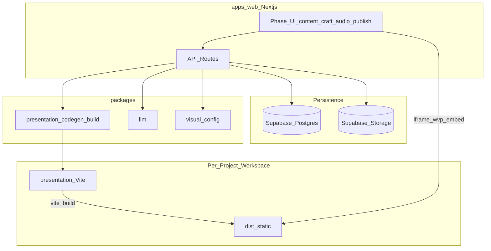

# CourseFlow v2 — 技術架構

## 系統總覽

- **Studio** 負責編輯與編排；**不**在瀏覽器直接跑 Vite dev。
- 每專案一份 **presentation 工作區**（本機或 `COURSEFLOW_PRESENTATION_ROOT`），打包產物可上傳 Storage 供 Render 預覽。

---

## apps/web

| 區塊 | 路徑 | 職責 |
|------|------|------|
| 頁面 | `src/app/projects/[id]/*` | 四階段 UI + `wvp-play` 全螢幕預覽 |
| API | `src/app/api/projects/[id]/**` | CRUD、生成、WVP 同步、匯出 |
| 領域邏輯 | `src/lib/wvp-*.ts` | Craft、配圖、打包、鎖定 |
| 元件 | `src/components/*PhaseClient.tsx` | 各階段互動 |

### 重要 API（節錄）

| 方法 | 路徑 | 說明 |
|------|------|------|
| POST | `/api/projects/:id/wvp/trial-chapter-1` | 試執行第 1 章 |
| POST | `/api/projects/:id/wvp/batch-craft` | 批次章節 Craft |
| POST | `/api/projects/:id/generate-content` | 文稿／螢幕內容 LLM |
| GET | `/api/projects/:id/wvp/chapters/:cid/illustrations/:step/image` | 工作室配圖預覽 |
| POST | `.../phases/:phase/lock` | 階段鎖定 |

靜態預覽：`GET /projects/:id/wvp-embed/**` → 讀 `presentation/dist`。

---

## packages/presentation

| 模組 | 職責 |
|------|------|
| `scaffold.ts` | 從 WVP 模板複製建立 `presentation/`（**會清空**該目錄） |
| `codegen/` | 依版型產生 `Chapter*.tsx`、`narrations.ts` |
| `codegen/chapter.ts` | 選擇 list-reveal / flow / hook / magazine / **visual-mix** |
| `codegen/step-image-codegen.ts` | 產生 `stepImageUrl(step)` 嵌入 TSX |
| `build.ts` | `npm run build`（Vite），設定 `CF_STUDIO_PREVIEW_BASE` |
| `sync-illustrations.ts` | 寫入 `public/images/<chapterId>/NN.ext` |

### 章節模板選擇（摘要）

1. 若 `forceTemplate` 有值 → 使用該模板（試跑常用 `list-reveal`）。
2. 否則若有足夠 `stepVisualConfigs` 且 **無** 步驟配圖 → **visual-mix**。
3. 否則依 `chapterKind` / `inferChapterKind` → list-reveal、flow、hook、magazine。

有工作室配圖時必須走含 `` 的模板（見 [WVP-ILLUSTRATIONS.md](./WVP-ILLUSTRATIONS.md)）。

---

## 資料庫（Supabase）

主要 migration：`20260524000000_initial_schema.sql`、`20260601000000_v2_wvp_extensions.sql`。

| 表／欄 | 用途 |
|--------|------|
| `projects` | `composition`、`wvp_settings`、`wvp_phase_locks`、`theme_id` |
| `chapter_craft` | 每 WVP 章節：`craft_status`、`checklist_result`（含 `chapterSource`、`stepIllustrations`） |
| `user_api_keys` | 使用者自帶 LLM API Key（加密） |

`checklist_result` 為 JSON，重要欄位：

- `narrations` — 章節口播陣列  
- `chapterSource` — `{ chapterTsx, chapterCss, source, templateKind }`  
- `stepIllustrations` — 配圖工作室狀態  
- `stepVisualConfigs` — 宣告式視覺（visual-mix）  
- `appliedTemplate` — 試跑套用之模板 id  

Storage bucket（預設 `courseflow-v2-assets` 或 `courseflow-assets`，以 env／migration 為準）：

- 使用者素材、WVP dist 快取  
- 配圖：`{userId}/{projectId}/wvp-illustrations/{wvpChapterId}/01.jpg`  

---

## apps/worker

BullMQ 消費者：TTS、MP4 錄製等。本機設 `COURSEFLOW_INLINE_JOBS=1` 時，多數工作改在 `apps/web` API 內同步執行。

佇列名稱：`packages/shared/src/queue-names.ts`（v2 前綴，避免與 v1 衝突）。

---

## 相依與建置順序

Turbo `dev` 依賴關係大致為：

`shared` → `core` → `llm` / `presentation` / `visual-config` → `web`

修改底層套件後需重新 `build` 該套件，否則 Next 仍載入舊 `dist/`。

---

## 與 WVP Skill 的關係

方法論原文在 `skills/web-video-presentation/`。`pnpm sync-wvp` 會同步至 `packages/wvp-bridge/vendor/`。

**產品化層**（CourseFlow 獨有）在 `apps/web` + `packages/presentation`：資料庫、配圖、階段鎖、打包 API，Skill 本身不包含這些。
