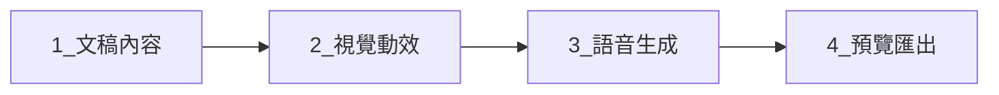

# CourseFlow v2 — 接手指南

本文件協助新成員在 **半天內** 完成環境建置、理解產品流程，並知道修改功能時該動哪裡。

## 建議閱讀順序

| 順序 | 文件 | 用途 |
|------|------|------|
| 1 | 本文件 | 上手與日常開發 |
| 2 | [CONTEXT.md](../CONTEXT.md) | 詞彙與檔案索引 |
| 3 | [ARCHITECTURE.md](./ARCHITECTURE.md) | 架構、API、資料表 |
| 4 | [WVP-ILLUSTRATIONS.md](./WVP-ILLUSTRATIONS.md) | 配圖／試跑／打包 |
| 5 | [VISION-v2.md](./VISION-v2.md) | 產品願景與刻意不做的事 |
| 6 | [skills/web-video-presentation/SKILL.md](../skills/web-video-presentation/SKILL.md) | WVP 方法論原文 |

部署與維運另見：[INFRA-ISOLATION.md](./INFRA-ISOLATION.md)、[DEPLOY-RENDER.md](./DEPLOY-RENDER.md)、[DEPLOY-CUTOVER-courseflow-web.md](./DEPLOY-CUTOVER-courseflow-web.md)。

---

## 一、5 分鐘啟動

### 需求

- Node.js **22+**
- pnpm **9+**
- 專用 **Supabase** 專案（勿與 v1 混用）
- Redis（本機可選；設 `COURSEFLOW_INLINE_JOBS=1` 可略過 Worker）

### 步驟

```bash
git clone https://github.com/taiwanveo/CourseFlow2.git
cd CourseFlow2
pnpm install

# 環境變數：複製根目錄 .env.v2.example
# → apps/web/.env.local
# → apps/worker/.env（若要跑佇列）

supabase link   # 或 Dashboard 手動套用 migrations
supabase db push

pnpm sync-wvp   # 同步 WVP skill 到 vendor 模板
pnpm dev        # http://localhost:3000
```

**注意**：必須用 `pnpm dev`（會先 `turbo build` 各 `@courseflow/*` 套件）。只跑 `next dev` 會出現 `Can't resolve '@courseflow/...'`。

修改 `packages/*` 後若 API 仍載入舊程式，執行：

```bash
pnpm --filter @courseflow/presentation build
pnpm --filter @courseflow/llm build
# 然後重啟 pnpm dev
```

---

## 二、產品流程（使用者視角）



| 階段 | 路由 | 使用者做什麼 | 系統產出 |
|------|------|--------------|----------|
| 文稿內容 | `/projects/:id/content` | 編輯大綱、口播、螢幕內容 | `composition`、章節清單 |
| 視覺動效 | `/projects/:id/craft` | 試執行第 1 章、配圖、批次 Craft | `chapter_craft`、配圖檔、章節 TSX |
| 語音生成 | `/projects/:id/audio` | TTS | `public/audio/*.mp3` |
| 預覽匯出 | `/projects/:id/publish` | 打包預覽、MP4 | `presentation/dist`、Storage |

另有 **Checkpoint**（`/checkpoint`）：主題、素材 URL、生圖風格等，寫入 `projects.wvp_settings`。

各階段可 **鎖定**（`wvp_phase_locks`），鎖定後不可再編輯該階段以前的内容。

---

## 三、Monorepo 結構

```
apps/web/           Next.js 15 App Router（Studio + API）
apps/worker/        BullMQ：TTS、MP4 等背景工作
packages/
  core/             共用型別、WVP 階段鎖
  presentation/     WVP 腳手架、章節 codegen、Vite 建置
  craft-agent/      章節 Craft 提示詞與自檢
  llm/              LLM 呼叫、生圖、文稿提示詞
  visual-config/    宣告式 chart/table/animation（Visual Director）
  wvp-bridge/       WVP 主題與 vendor 模板
  composition/      文稿 JSON 結構
  tts/              語音合成介面
  shared/           佇列名稱等
skills/             web-video-presentation（pnpm sync-wvp 同步）
supabase/migrations  Postgres schema
data/presentations/ 本機每專案 WVP 工作區（gitignore）
```

---

## 四、核心資料與「真相源」

| 資料 | 存放 | 說明 |
|------|------|------|
| 文稿結構 | DB `composition` + Storage | 章節、步驟、script、screenContent |
| 章節 Craft 狀態 | `chapter_craft` | checklist、chapterSource、stepIllustrations |
| 專案 WVP 設定 | `projects.wvp_settings` | 主題、素材、錨點章節、生圖風格 |
| 可播放章節碼 | 本機 `presentation/src/chapters/` | 打包時寫入，建置進 `dist/` |
| 步驟配圖 | Storage + `public/images/` | 檔名 `01.jpg`、`02.gif`… 對應 step 0、1… |

**螢幕內容優先規則**（見 `.cursor/rules/screen-content-first.mdc`）：畫面主標用 `screenContent`，不可用整段口播當大字。

---

## 五、開發時常改的路徑

### 新增／調整章節版型

1. 模板：`packages/presentation/src/codegen/templates/*.ts`
2. 播放元件：`packages/wvp-bridge/vendor/.../templates/src/components/`
3. 路由邏輯：`packages/presentation/src/codegen/chapter.ts`（含 visual-mix 是否啟用）
4. 執行 `pnpm --filter @courseflow/presentation build` 後重啟 web

### 配圖／試跑／打包

見專文 [WVP-ILLUSTRATIONS.md](./WVP-ILLUSTRATIONS.md)。重點：

- 試跑順序：**先同步配圖 → 再 materialize 章節 → 再 Vite build**
- 有工作室配圖時 **不要** 用 visual-mix 蓋掉 list-reveal／magazine

### LLM 提示詞

- 文稿／螢幕內容：`packages/llm/src/prompts.ts`
- 章節 Craft：`packages/craft-agent/`
- 視覺決策：`packages/visual-config/`

### API 路由慣例

`apps/web/src/app/api/projects/[id]/...` — 多數需 Supabase session，並檢查 `wvp_phase_locks`。

---

## 六、環境變數速查

| 變數 | 說明 |
|------|------|
| `COURSEFLOW_EDITION` | 設 `v2` |
| `COURSEFLOW_INLINE_JOBS` | `1` = 不經 Redis，Web 行程內跑 TTS/錄製 |
| `COURSEFLOW_PACK_ILLUSTRATIONS` | `0` 略過／`1` 強制 AI 重算配圖／預設沿用工作室圖 |
| `COURSEFLOW_PRESENTATION_ROOT` | 自訂 `data/presentations` 根目錄 |
| `API_KEY_ENCRYPTION_SECRET` | 使用者 LLM API Key 加密 |

完整範例：[.env.v2.example](../.env.v2.example)。

---

## 七、品質與驗收

| 主題 | 文件 |
|------|------|
| 章節自檢 | [skills/.../CHAPTER-CRAFT.md](../skills/web-video-presentation/references/CHAPTER-CRAFT.md) |
| A1–A3 驗收 | [WVP-ACCEPTANCE-A1-A3.md](./WVP-ACCEPTANCE-A1-A3.md) |
| 品質量表 | [WVP-QUALITY-RUBRIC.md](./WVP-QUALITY-RUBRIC.md) |
| 宣告式視覺 | [WVP-VISUALCONFIG.md](./WVP-VISUALCONFIG.md) |

---

## 八、常見問題（FAQ）

### `pnpm dev` 後改 packages 沒生效？

先 `pnpm --filter @courseflow/<pkg> build`，再重啟 dev server。

### 試跑／預覽完全沒配圖？

1. 視覺動效工作室是否顯示「完成」  
2. 是否用 **重新試執行**（會重建 dist）  
3. 讀 [WVP-ILLUSTRATIONS.md](./WVP-ILLUSTRATIONS.md) 檢查是否被 visual-mix 蓋版  

### 與 v1 衝突？

v2 請用 **獨立 Supabase** 與建議 **port 3001**（見 INFRA-ISOLATION）。

### Migration 未套用？

`supabase db push`，含 `20260601000000_v2_wvp_extensions.sql`、`20260602000000_backfill_wvp_phase_locks.sql` 等。

---

## 九、聯絡與延伸

- 路線圖：[WVP-ROADMAP-NEXT.md](./WVP-ROADMAP-NEXT.md)  
- v1→v2 決策背景：[references/v1改版v2的原因.md](../references/v1改版v2的原因.md)  
- 問題排查：先查 `apps/web` 終端與 API 回應；WVP 建置 log 標 `[wvp-build]`

接手後建議先走一輪：**建立專案 → 文稿 → 上傳兩張配圖 → 試執行第 1 章 → 語音 → 打包預覽**，以熟悉端到端路徑。
