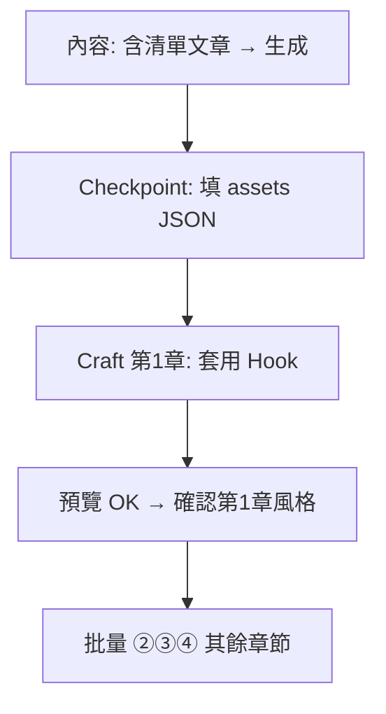

# WVP 驗收指南 — A1、A2、A3

> 完成本輪三項補強後，依下列步驟驗收。通過後再進行 [WVP-ROADMAP-NEXT.md](./WVP-ROADMAP-NEXT.md) 的 **B1–B4**（宣告式 VisualConfig）。

---

## 前置

1. 本機已啟動 `apps/web`（`pnpm dev` 或專案慣用指令）。
2. 專案已走過：**內容** → **Checkpoint** → **Craft** 至少到第 1 章。
3. Supabase migration 已套用（與既有 WVP 相同，本輪無新 migration）。

---

## A3 — 素材 URL 寫入章節 TSX

### 操作

1. 進入專案 **Checkpoint** 階段。
2. 在「**章節素材**」區塊按 **上傳圖片**（可多選）。
3. 每張圖在列表中選擇 **綁定章節**（下拉選單），可填 **alt 說明**。
4. 按 Checkpoint **儲存**（或鎖定前會自動儲存）。

### 通過標準

- Craft 第 1 章按 **套用 Hook 開場** 或執行 **② 生成** 後，打開工作目錄內 `presentation/src/chapters/01-<章節id>/Chapter*.tsx`。
- 檔內 `SLIDES` 陣列的 `url` 為你填的網址（不是永遠 `null`）。
- **課程預覽** 中對應步驟顯示真實 ``；若 URL 無效則為 16:9 placeholder 框（仍算通過 A3 接線，需自行換有效圖址）。

---

## A1 — Hook 多圖開場

### 操作

1. 完成 A3 的素材 JSON（或故意留空測 placeholder）。
2. Craft 選第 1 章 → **套用 Hook 開場**。
3. **③ 同步口播**（若步數有變）→ **④ 打包預覽** → 開啟播放。

### 通過標準

| 步驟序 | 畫面預期 |
|--------|----------|
| 0 | 三格 ghost 網格 + kicker 引子 |
| 1…N | 逐張全屏大圖 + 標號 + caption |
| N+1 | 三張縮圖列 + 粗體 hero 標題（takeover） |
| （可選）最後一步 | 收束金句 + 筆刷底線 |

- 右側／底部進度與 **點擊步數** 與 `narrations.ts` 條數一致（Hook 通常比「內容」原始步數多，以 Craft 儲存的 `narrations` 為準）。
- Checklist 含 **Hook 型：使用 HookImageStrip** 且為通過。

---

## A2 — 清單 1 項 1 step（內容階段）

### 操作

1. 新建或重置專案 **內容** 階段。
2. 貼上含明確清單的文章，例如：

```text
本章有三個重點。第一、資料要先清洗。第二、模型要可解釋。第三、結果要能重現。
```

3. 按 **AI 生成大綱與口播**（`generate-content`）。

### 通過標準

- 內容編輯器內，該章 **步驟數 ≥ 4**（1 引子 + 3 項），而非整段擠在 1 步。
- 進入 Craft 後，該章 **② 生成** 預設走 **list-reveal**（或手動 **套用清單揭示**），預覽為 `ListRevealGrid` 逐格亮起。
- `chapter_craft.checklist_result` 中 list-reveal 相關項為通過。

---

## 建議完整流程（一次跑通）



1. **A2**：內容生成 → 確認清單拆步。
2. **A3 + A1**：Checkpoint 素材 → 第 1 章 Hook → 預覽。
3. **Anchor**：確認第 1 章風格後，再批量其餘章（②③④）。

---

## 常見問題

| 現象 | 處理 |
|------|------|
| Hook 仍是 placeholder | 確認圖片已綁定正確章節 id；URL 為 Supabase 公開連結且可載入 |
| 步數與口播對不上 | 先 **套用 Hook** 再 **③ 同步**；以 Craft 顯示的 narrations 條數為準重新打包 |
| 清單沒拆步 | 文章需至少 2 個「第一／第二」或 `1.` `2.` 或換行條列；極短句不會觸發 A2 |
| 批量被擋 | 需先 **確認第 1 章風格**（`anchorChapterApproved`） |

---

## 通過後

回覆「A 驗收 OK」即可開始 **B1–B4**（`VisualConfig` schema + Renderer）。
