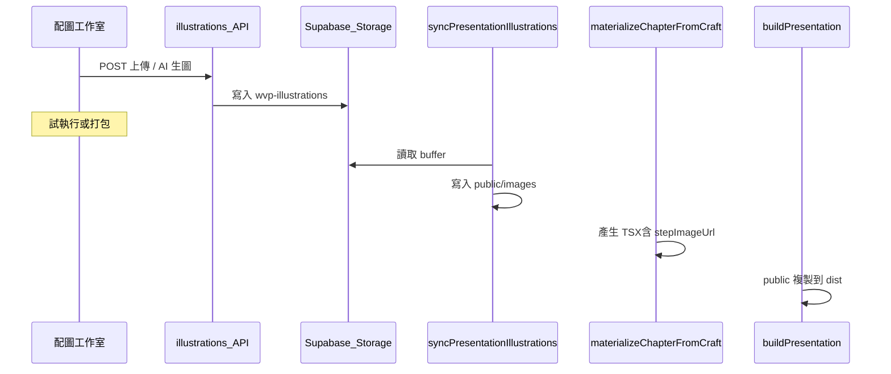

# WVP 配圖管線 — 維護說明

配圖是試跑與匯出最容易出問題的環節。本文說明檔案命名、同步順序、版型衝突與除錯方式。

## 檔案約定

| 項目 | 規則 |
|------|------|
| 步驟索引 | **0-based**（與 composition 步驟一致） |
| 檔名 | **1-based** 兩位數 + 副檔名：`01.jpg`、`02.gif`、`03.png` |
| 本機路徑 | `data/presentations/<projectId>/presentation/public/images/<wvpChapterId>/` |
| Storage | `{userId}/{projectId}/wvp-illustrations/<wvpChapterId>/<檔名>` |
| 播放 URL | `{BASE_URL}images/<wvpChapterId>/01.ext`（`stepImageUrl(step)` 產生） |

支援副檔名：jpg、jpeg、png、bmp、gif。APNG 以 **png** 儲存。

程式入口：

- `packages/presentation/src/step-image-media.ts` — 偵測格式、檔名  
- `apps/web/src/lib/wvp-step-image-resolve.ts` — 讀取 Storage／本機、解析 ext 對照表  
- `apps/web/src/lib/wvp-craft-illustrations.ts` — 工作室上傳／生圖  

## 工作室 → 預覽 資料流

### 試執行第 1 章（`buildAnchorChapterPreview`）順序

1. `ensurePresentationScaffolded`（**會清空**該專案 `presentation/` 後重建模板）  
2. `syncPresentationIllustrations`（`reuseExistingFiles: true`）  
3. `rebuildRegistryForProject` → `materializeChapterFromCraft`（帶 `stepImageExtensions`）  
4. `buildProjectPresentation`（Vite）  

**不可** 在配圖寫入前就 materialize，否則 `STEP_IMAGE_EXT` 與實際副檔名不一致，瀏覽器 404。

### 完整打包

在 `syncFullWvpProject` 中，配圖同步後會 **再次** `rebuildRegistryForProject`，以更新章節 TSX 中的副檔名。

## 版型與配圖

| 模板 | 配圖顯示方式 |
|------|----------------|
| **list-reveal** | 第 0 步 `introImageUrl`；其後每項 `items[i].imageUrl` |
| **magazine** | `ChapterFigure` + `stepImageUrl(step)` |
| **flow** | 側欄 `stepImageUrl(step)` |
| **hook** | Checkpoint `assets[]` URL |
| **visual-mix** | **無步驟配圖**，僅 chart/table/CSS 動畫 |

### visual-mix 何時啟用（`codegen/chapter.ts`）

僅在 **同時** 滿足：

- 未指定 `forceTemplate`  
- `stepImageExtensions` 為空（本機無已打包配圖檔）  
- 無 Checkpoint 上傳素材  
- 有足夠 `stepVisualConfigs`（宣告式動畫／圖表）  

有工作室配圖時應走 **list-reveal** 等；試跑會設 `appliedTemplate: list-reveal`。

## 同步時哪些步驟會複製配圖

`wvp-illustration-sync.ts` 對每一步：

1. 若 `stepIllustrations` 標記完成 → 嘗試 `readChapterIllustrationImage`（含 Storage 列表、`storagePath` 提示）  
2. 若無則可從 composition 的 image 元素讀取  
3. `recommendedOutput === animation'` 時 **不** AI 生圖，但仍可沿用已有工作室圖  

list-reveal 的 `wvpStepNeedsIllustration` 含 **step 0**（章節分隔頁配圖）。

## 環境變數

| 變數 | 值 | 效果 |
|------|-----|------|
| `COURSEFLOW_PACK_ILLUSTRATIONS` | 未設 / 其他 | 預設 **沿用** 工作室圖 |
| | `1` | 強制 AI 重算配圖 |
| | `0` | 打包時略過配圖同步 |

## 除錯檢查清單

1. **工作室**：該步 `status: done`、`imageWritten: true`  
2. **本機檔案**：`data/presentations/<id>/presentation/public/images/<chapter>/01.*` 是否存在  
3. **章節 TSX**：是否含 `stepImageUrl`、`STEP_IMAGE_EXT`  
4. **dist**：`presentation/dist/images/...` 建置後是否存在  
5. **Network**：預覽 iframe 內圖片 URL 是否 404；副檔名是否不符（例如 TSX 寫 jpg 實際 gif）  
6. **版型**：是否誤用 visual-mix（畫面只有動畫沒有 img）  

### 常見修復

- 重新上傳配圖 → **重新試執行第 1 章** 或發布頁 **打包**  
- 修改 `packages/presentation` 後：`pnpm --filter @courseflow/presentation build` + 重啟 dev  

## 相關 UI 規則

- 螢幕主標用 `screenContent`，見 `.cursor/rules/screen-content-first.mdc`  
- AI 生圖文字語系見 `.cursor/rules/ai-image-text-language.mdc`  
