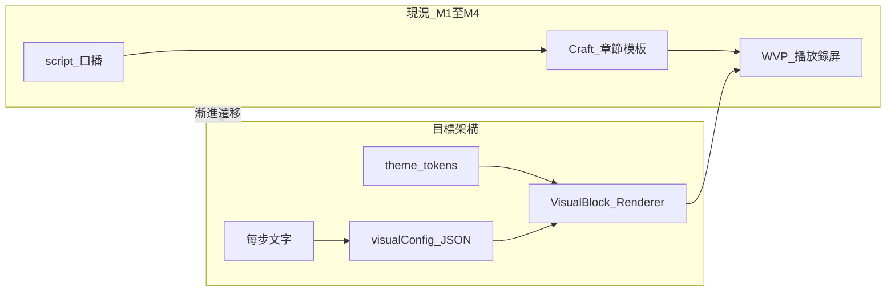

# CourseFlow WVP — 下一階段路線圖

> **終極目標**：自動化產出「**內容感知** × **主題風格一致**」的資料視覺化簡報／影片（16:9 互動網頁 + MP4 錄屏）。
>
> 本文件整合：(1) 上一輪 M1–M4 後的三項待辦；(2) 朋友提供的 [主題×內容感知指南](../references/theme-content-aware-slide-viz-guide.md)；(3) [SlideVisualAI 原型](../references/SlideVisualAI.jsx)。

---

## 架構對照：現況 vs 朋友建議

| 層次 | 朋友建議（宣告式契約） | CourseFlow 現況 | 整合方向 |
|------|------------------------|-----------------|----------|
| **Design Token** | `DesignTokens` 唯一真實來源 | WVP `themes/*/tokens.css` + `--accent` 等 | **沿用**，從 `theme_id` 映射為結構化 token 餵 LLM + Renderer |
| **LLM 輸出** | `VisualConfig` JSON（zod 驗證） | `stepVisuals` + 整章 `Chapter.tsx` | **逐步改**：每 step 先產 `visualConfig`，再渲染，少讓 LLM 寫整檔 TSX |
| **Renderer** | Chart / Table / Animation | `ListRevealGrid`、`FlowDiagram`、`NarrationBeat` | **擴充** `VisualBlock`（chart/table/animation），與現有章節模板並存 |
| **主題感知** | `colorRole` → token 色票（禁止 LLM 吐 hex） | SlideVisualAI 讓 LLM 吐 `#hex`（較鬆） | **採指南版**：語意角色 + renderer 對應 token |
| **內容感知** | 依文意選 bar/line/pie/kpi、table、reveal-list | `inferChapterKind` → list/flow/magazine | **保留路由** + 每步內再跑 chart/table 決策 |



---

## 待辦 A — 三項補完（上一輪承諾）

| ID | 項目 | 說明 | 驗收 |
|----|------|------|------|
| **A1** | Hook 多圖開場 | `HookImageStrip` + hook 模板；Checkpoint `assets[]` 注入 `` | 開場章可逐張揭示圖 + hero takeover |
| **A2** | 內容階段清單 1 項 1 step | 生成 composition / outline 時，偵測「第一第二…」自動拆 step | 口播步數 = 引子 + N 項，Craft 自動走 list-reveal |
| **A3** | 素材 URL 寫入 Chapter | `wvp_settings.assets` → generate / materialize 帶入 TSX | hook 步驟顯示真圖，無圖則 placeholder 卡 |

---

## 待辦 B — 整合朋友的「宣告式視覺化」（核心升級）

> 原則：**LLM 決策、Renderer 執行**（見指南 §1）。不取代 WVP 章節全屏 step，而是在**合適的 step 內嵌** `VisualBlock`。

### B1 — Schema + Token 橋接（MVP）

- 新增 `packages/visual-config/`（或 `packages/presentation/src/visual/`）：
  - `schema/visual.ts` — 對齊指南：`chart` | `table` | `animation`（`reveal-list` / `process-flow` / `callout`）
  - `theme-bridge.ts` — 從 WVP `tokens.css` / `theme.json` 讀出 `DesignTokens` 子集
- `generateVisualConfig(stepScript, articleSnippet, themeId)` → zod 驗證 + 重試（指南 §5.3）

### B2 — Renderer 層（對齊 SlideVisualAI，改進配色）

- `ChartRenderer` — **recharts**（與 [SlideVisualAI.jsx](../references/SlideVisualAI.jsx) 同族，但 **colors 來自 token + colorRole**，不採 raw hex）
- `TableRenderer` — 純 React + 逐列進場（可先 CSS，後接 Framer Motion）
- `AnimationRenderer` — 與現有 `ListRevealGrid` / `FlowDiagram` **合併或共用** stagger 規則
- `VisualBlock.tsx` — `switch (config.kind)`

### B3 — 接入 WVP Craft 管線

- 每步 `composition.steps[]` 可選欄位：`visualConfig?: VisualConfig`
- Craft ②③ 流程：
  1. 既有 `chapterKind` 路由（list / flow / magazine）
  2. 對「含數字／比例／對照」的 step，LLM 產 `visualConfig`，章節 TSX 改為 `<VisualBlock config={...} />` + 標題口播
- 建置前 checklist 新增：`visual-config-valid`

### B4 — 評測與降級（指南 §7）

- 黃金案例 20 則（時序、比例、清單、單一 KPI）
- 驗證失敗 → fallback `animation` + `callout` 或既有 `NarrationBeat`

---

## 建議實作順序

```
Phase 1（體驗補齊）  A1 → A2 → A3
Phase 2（架構地基）  B1 → B2（Chart + Animation 先）
Phase 3（產品接線）  B3 → 與 anchor / batch-craft / export-readiness 串接
Phase 4（品質）      B4 + TableRenderer + visx 進階（可選）
```

---

## 與 [WVP-QUALITY-RUBRIC.md](./WVP-QUALITY-RUBRIC.md) 的關係

| Rubric 條目 | 待辦覆蓋 |
|-------------|----------|
| 清單 1 項 1 step | A2 + B3 animation.reveal-list |
| 流程動畫 | 已有 FlowDiagram；B3 process-flow 可統一 schema |
| 雙源 / 數字圖表 | B1–B3 chart.kpi / bar / pie |
| 主題一致 | B1 theme-bridge + colorRole |

---

## 參考文件索引

| 檔案 | 用途 |
|------|------|
| [references/theme-content-aware-slide-viz-guide.md](../references/theme-content-aware-slide-viz-guide.md) | 宣告式契約、三層架構、Cursor 分階段實作 |
| [references/SlideVisualAI.jsx](../references/SlideVisualAI.jsx) | recharts 圖表 renderer 原型（需改為 token 驅動） |
| [packages/wvp-bridge/.../CHAPTER-CRAFT.md](../packages/wvp-bridge/vendor/web-video-presentation/references/CHAPTER-CRAFT.md) | 全屏 step、反 AI 味、雙源 |
| [docs/VISION-v2.md](./VISION-v2.md) | 產品五階段與 WVP 終局 |

---

## 一句話策略

**短期**：把 Hook、拆 step、素材接好，維持你已驗收過的 list/flow 章節感。  
**中期**：在每個需要的 step 嵌入朋友的 **VisualConfig → VisualBlock**，用 WVP 主題 token 上色，讓「有數字就上圖表、有清單就揭示、有流程就點亮」變成自動化，而不是只靠 LLM 寫整章 TSX。
